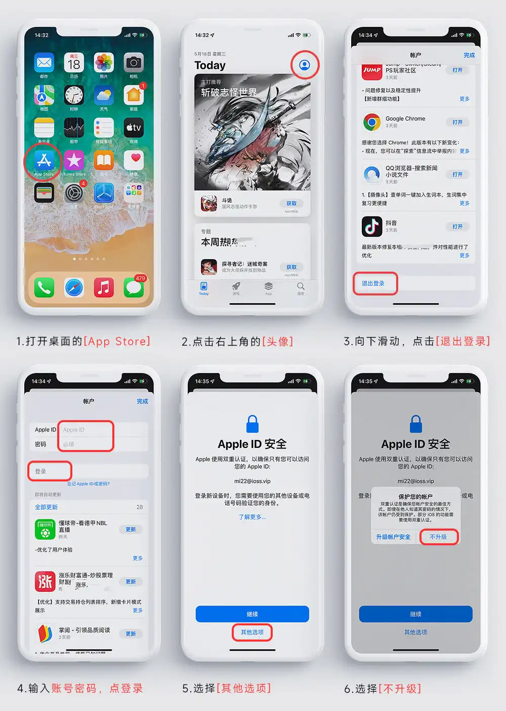

## 最新苹果美区APPLE ID账号🚀免费共享Shadowrocket（小火箭）账号🚀免费小火箭节点订阅地址合集

📢 最新免费美区Apple ID、小火箭、圈X共享账号与高速节点，每日更新！🚀 **免费共享 Apple 美区账号（Apple ID）**，专为需要访问 App Store 下载 **Shadowrocket（小火箭）**、Quantumult X（圈X）、Stash 等科学上网工具的用户提供便利！

[【小火箭共享账号每日更新】](https://docs.applexp.com/free-accounts/Shadowrocket)

#### 购买独享账号（小火箭独享账号，苹果各国ID，等各类账号）[【点击进入购买】](https://juzixp.com/)

#### 购买共享账号地址：[【 点击进入购买】](https://juzixp.com/buy/21)

<!-- #### [App Store 美区礼品卡 $3](https://juzixp.com/buy/31) | [App Store 美区礼品卡 $10](https://juzixp.com/buy/33) | [App Store 港区礼品卡 HK$50](https://juzixp.com/buy/39) -->

## 前言声明

> 此教程为了是让大家学习，切勿做违法犯罪的事哦！

1. [TG群组](https://t.me/juzixpchat) ：[@juzixpchat](https://t.me/juzixpchat)

2. [TG频道](https://t.me/juzixp)：[@juzixp](https://t.me/juzixp) 

不定期更新免费订阅节点,共享小火箭账号，美区AppleID等。

---

🔥 同步更新高质量节点资源：

* ✅ **小火箭账号共享（Shadowrocket Apple ID）**
* ✅ 免费 Clash / ClashX / ClashX Pro 节点订阅地址
* ✅ 免费 SSR / V2Ray / Trojan 节点
* ✅ 适用于 iOS / Mac / Windows / Android 各平台
* ✅ 支持 OpenAI ChatGPT、YouTube、Telegram、Google 等境外服务访问

💡 **节点每日更新**，共享稳定高速，无需注册登录，完全免费！

---

### 🌐 支持应用：

* Shadowrocket（小火箭）
* Quantumult X（圈X）
* Stash
* Clash / ClashX / ClashX Pro
* Surge（部分节点支持）

---

### 🧩 仓库功能亮点：

* 📦 [免费订阅地址](#-免费机场与节点推荐2025-最新)，无限使用
* 🚀 节点高速稳定，可解锁 ChatGPT 与流媒体
* 🔄 每日自动更新，保持最新可用状态
* 🍎 不定时更新 Apple 美区共享 ID，轻松下载外区 App

---
## 🚀小火箭+节点转换教程

### 一、什么是 Shadowsocks？

**Shadowsocks（简称 SS）** 是一种基于 SOCKS5 协议的网络代理工具，可对网络传输数据进行加密处理，广泛用于网络加速与科学上网。其主要特点包括：支持全平台（Windows、macOS、iOS、Android、Linux 等），加密传输，保护用户数据安全，支持配置多种服务器节点，灵活性高，开源轻量，资源占用少。

### 二、Shadowsocks / SSR 的使用方法

#### ✅ 常见使用方式（以 SS 为例，SSR 同理）：

##### 方式一：手动输入服务器信息

1. 右键任务栏中的“小飞机”图标
2. 打开 **服务器 → 编辑服务器**
3. 输入 IP、端口、加密方式、密码等信息
4. 保存后启用即可连接

##### 方式二：扫描屏幕二维码

1. 将 SS 节点二维码显示在屏幕上（网站、App、图片均可）
2. 右键小飞机图标，选择 **服务器 → 扫描屏幕上的二维码**
3. 系统将自动导入服务器配置并保存

##### 方式三：订阅链接一键导入

1. 复制订阅链接到剪贴板
2. 右键小飞机 → 服务器 → 从剪贴板导入 URL
3. 服务器信息将自动添加并生效

---

### 如何将节点转为小火箭（ Shadowsocks）节点

如果你对隐私和安全性要求更高，建议使用 **Docker 一键部署工具** 来自建 SS 服务。

推荐工具：

- [subconverter](https://github.com/tindy2013/subconverter)：支持订阅转换、节点合并过滤
- [sub-web](https://github.com/Cusdis/sub-web)：Web 前端界面订阅管理平台
- 在线转换工具：https://sub-web.netlify.app/

部署后可生成自定义订阅链接，适配 Shadowrocket、Clash、Surge 等多种客户端。

## 🎁 免费机场与节点推荐（2025 最新）

**PS：不保证都可用/多切换试试**，可以使用 [在线订阅转换链接](#小火箭节点转换教程) 转为符合自己客户端的链接

- 尝鲜可选择免费机场或节点
- 追求稳定的请选择付费机

[宝可梦](https://love.52pokemon.cc/register?code=DA8hMN5Y)：白嫖 60GB/月，入门套餐 ￥5.9，5月白嫖码：`呆河马`

### 🌍 SS / SSR / V2Ray 免费节点资源

#### 🔗 SSR 免费订阅地址：

- https://raw.githubusercontent.com/ssrsub/ssr/master/ssrsub
- https://www.liesauer.net/yogurt/subscribe
- 免费免费ssr节点分享1：[freefq.com](https://freefq.com/free-ssr/)
- 免费免费ssr节点分享2：[lncn.org](https://lncn.org/)（可能需要科学才能访问）

> 📌 **说明**：以上订阅文件会周期性更新，但节点可用性存在波动，建议使用支持订阅功能的客户端（如 SSR for Android、Shadowrocket 等）。

#### 🔗 VLESS / V2Ray 免费节点

- [https://free-ss.site](https://free-ss.site)（定期更新，含 VLESS/VMess 多协议）

### Clash代理节点订阅地址列表

以下是截至2025年6月24日整理的Clash代理节点订阅地址，均采用YAML格式，适用于Clash或ClashX客户端。

1. **SystemProxy 主配置文件**
   - 地址: https://raw.githubusercontent.com/SnapdragonLee/SystemProxy/master/dist/clash_config.yaml
   - 备注: 推荐用于一般用途，提供稳定的代理节点。
2. **SystemProxy US节点**
   - 地址: https://raw.githubusercontent.com/SnapdragonLee/SystemProxy/master/dist/clash_config_extra_US.yaml
   - 备注: 美国地区优化节点，适合需要访问美国服务的用户。
3. **NodeFree**
   - 地址: https://nodefree.org/dy/2024/07/20240725.yaml
   - 备注: 每日更新节点，需验证2025年最新可用性。
4. **Mfuu**
   - 地址: https://raw.githubusercontent.com/mfuu/v2ray/master/clash.yaml
   - 备注: 社区提供的免费订阅地址，适用于多种网络环境。
5. **Anaer**
   - 地址: https://raw.githubusercontent.com/anaer/Sub/main/clash.yaml
   - 备注: 稳定的Clash代理节点，适合长期使用。
6. **Ermaozi**
   - 地址: https://raw.githubusercontent.com/ermaozi/get_subscribe/main/subscribe/clash.yml
   - 备注: 社区维护的订阅地址，包含多种代理节点。
7. **Learnhard-cn**
   - 地址: https://cdn.jsdelivr.net/gh/vxiaov/free_proxies@main/clash/clash.provider.yaml
   - 备注: 社区提供的免费代理节点，适合广泛用途。

### 📚 免费资源仓库 & 更新站

| 名称                                                         | 描述                               | 更新频率       |
| ------------------------------------------------------------ | ---------------------------------- | -------------- |
| [**GetNode**](https://github.com/Flik6/getNode)              | 聚合多协议节点源，支持 Clash/v2ray | 每小时自动更新 |
| [**v2cross**](https://v2cross.com/archives/1884)             | 提供 SS / VMess / Trojan 节点      | 持续更新       |
| [**Free-servers**](https://github.com/Pawdroid/Free-servers) | 包含 ss / v2ray / trojan 节点      | 每 6 小时更新  |
| [**v2rayfree**](https://github.com/aiboboxx/v2rayfree)       | 专注 v2ray 协议免费节点            | 频繁更新       |

**PS：以上仓库中付费的内容，请谨慎购买，只推荐使用免费，下面有付费机场为博主在用的，追求稳定的建议使用博主推荐的。**

### 搜索免费订阅链接技巧

1. 在 Github 搜索：`/api/v1/client/subscribe` ，找到订阅链接 如`https://sub1.smallstrawberry.com/api/v1/client/subscribe?token=xxx`复制`sub1.smallstrawberry.com` 到网站搜索栏中进行搜索，找更新日期最新的，左侧 Filter by 选择 `Code`，找到订阅链接使用即可。
2. 在 Github 搜索：`lzysub.online path:/^sub\/2024\/7\//`，左侧 Filter by 选择 `Code`，找到订阅链接使用即可（[点此直达](https://github.com/search?q=lzysub.online+path%3A%2F^sub\%2F2024\%2F7\%2F%2F&type=code)）
3. 在 Google 搜索：`api v1 client subscribe token`，工具 - 时间筛选，找到最新的订阅链接使用即可

## 🚀 付费机场推荐合集

> 📌 **温馨提示：建议选择「月付」套餐，谨防跑路风险。以下为站长实测在用机场，均支持流媒体解锁与 ChatGPT 使用。**

### 🕊️ [SakuraCat](https://sakuracat.shop/register?code=shdLFSWp)（IPLC专线 · 稳定价格低 · 多平台支持）

> 亲测稳定！支持晚高峰不卡顿，支持全球节点访问 ChatGPT。

- **节点数量**：38+ 专线节点（全 IPLC）
- **流媒体支持**：全节点解锁 Netflix / Disney+ 等主流平台
- **AI 支持**：全节点可直连 ChatGPT、Claude、Bard 等工具
- **客户端支持**：支持 Clash / Shadowrocket / v2ray / Surge 等
- **连接设备**：无限制
- **网址：**[SakuraCat](https://sakuracat.shop/register?code=shdLFSWp)

#### 💰 套餐价格（限时优惠中）

| 流量 | 价格 | 周期  |
| ---- | ---- | ----- |
| 95GB | ¥8.8 | 30 天 |

### 🌿 [FlyingBird](https://fbinv02.fbaff.cc/auth/register?code=suXcBa1W)（全专线 IPLC · 超稳定 · 多平台支持）

> **博主强烈推荐，亲测稳定！支持晚高峰不卡顿，支持全球节点访问 ChatGPT。**

- **节点数量**：70+ 专线节点（全 IPLC）
- **流媒体支持**：全节点解锁 Netflix / Disney+ 等主流平台
- **AI 支持**：全节点可直连 ChatGPT、Claude、Bard 等工具
- **客户端支持**：支持 Clash / Shadowrocket / v2ray / Surge 等
- **连接设备**：无限制
- **网址：**[FlyingBird](https://fbinv02.fbaff.cc/auth/register?code=suXcBa1W)

#### 💰 套餐价格（限时优惠中）

| 流量  | 价格 | 周期  |
| ----- | ---- | ----- |
| 100GB | ¥15  | 30 天 |

- 月/季/半年付享 **85折** 优惠码：`fb2561885`（可用 5 次）
- 年付享 **8 折** 优惠码：`fb2561880`（可用 5 次）
- 活动截止：**2025 年 6 月 20 日 23:59**

🔗 [FlyingBird 访问地址](https://fbinv02.fbaff.cc/auth/register?code=suXcBa1W)

### ⚡ [YepFast](https://yep.top/#register?code=fXJDQ4X9)（多平台客户端 · 稳定高端）

> 拥有自研客户端（Windows / macOS / Android），支持小火箭。国际线路高质量保障，适合需要稳定流媒体体验的用户。

- **节点数量**：40+ 高质量中继线路
- **流媒体支持**：解锁 Netflix / Disney+ / YouTube Premium 等
- **AI 支持**：支持 ChatGPT / Copilot 等工具
- **客户端支持**：YepFast 专属客户端 / Shadowrocket（iOS）
- **设备连接数**：无限制
- **网址：**[YepFast](https://yep.top/#register?code=fXJDQ4X9)

#### 💰 套餐价格（限时活动）

| 流量  | 价格                 | 周期         |
| ----- | -------------------- | ------------ |
| 160GB | ¥11.9/月（年付 ¥99） | 每月重置流量 |

- **优惠码**：`yep85` 全场 85 折 + 免手续费
- **活动截止**：2025 年 6 月 3 日
- 支持套餐自动折抵升级（如月付转年付）

🔗 [YepFast 官网地址](https://椰皮.com/#register?code=fXJDQ4X9)

### 🧊 [一元机场](https://xn--4gq62f52gdss.ink/#/register?code=GDbjZxHa)（极致性价比 · 基础够用）

> 适合预算极低或偶尔使用外网需求的用户，不推荐重度使用。追求稳定请选上面推荐机场。

- **地区节点**：香港 / 日本 / 新加坡 / 美国
- **流媒体支持**：支持 Netflix / Disney+
- **不限速 / 不限连接数**
- **无退款服务，谨慎选购**
- **网址：**[一元机场](https://xn--4gq62f52gdss.ink/#/register?code=GDbjZxHa)

#### 💰 套餐价格

| 套餐类型 | 总价 | 月均    | 月流量 |
| -------- | ---- | ------- | ------ |
| 年付     | ¥12  | ¥1/月   | 50GB   |
| 两年付   | ¥20  | ¥0.8/月 | 50GB   |

🔗 [一元机场 官网地址](https://xn--4gq62f52gdss.ink/#/register?code=GDbjZxHa)

## 🔐 Shadowrocket（小火箭）共享账号 & 美区 Apple ID

> 🕒 更新时间：2025 年 8 月 13 日

[【小火箭共享账号每日更新】](https://docs.applexp.com/free-accounts/Shadowrocket)

注意：**免费共享苹果账号必须从 App Store 登录切勿在设置登陆iCloud账号！！不要点升级！不要点升级！不要点升级！**

1. 美区AppleID成品账号（已增加库存，数量有限，先到先得）：[小火箭 Shadowrocket 成品号 美国区](https://juzixp.top/buy/15)（**账号购买后可以修改密码、密保，并永久使用**）
2. 共享账号容易失效，需要稳定的可购买成品账号
3. 美区AppleID共享小火箭：[小火箭id共享账号，租用已购此App账号](https://juzixp.top/buy/21)下载（租用仅需 ¥3），租用与独享账号下载的 App 没有区别，下载的 App 只要不删除永久可用，`只是后续不能升级`。

### ⚠️ 使用须知（务必阅读）

- **严禁登录 iCloud**：只能在 **App Store** 登录共享账号用于下载 App，**千万不要登录 iCloud**，否则可能会导致设备锁定或数据泄露。
- **不要点击升级**：已下载的小火箭可永久使用，但不要点击更新操作。
- **共享账号不稳定**：免费账号存在被挤掉、失效风险。如需稳定使用建议购买成品账号。

### 🔗 推荐共享账号站点（免注册获取）	

> 此为第三方站长，只做分享，不保证质量安全，不解决使用中出现的问题

- [免费共享shadowrocket小火箭账号](https://ao.ke/)：有带shadowrocket的美区账号、台湾区、日本区、韩国区、香港区、英国区、土耳其区账号
- [最新小火箭账号/已购shadowrocket id共享Apple ID](https://shenhouyun.com/ios/)
- [宝盒](https://ccbaohe.com/appleID/)
- [AneeoApple](https://ios.aneeo.com/books/verification)：里面有美国、国区账号，密码需要关注Telegram群/公众号来获取

### 💰 成品账号推荐（长期稳定）

如果你需要**长期稳定使用 Shadowrocket（小火箭）**，推荐购买 **美区 Apple ID 成品账号**：

- ✅ 已购 Shadowrocket
- ✅ 可修改密码 / 密保
- ✅ 独享账号，**永久可用**
- ✅ 购买后可用于所有美区 App 下载，非租用

💡 比租用共享账号更安全，适合长期使用者。

🔗 [购买链接：小火箭成品号（美区 Apple ID）](https://juzixp.com/buy/15)

### 使用教程

